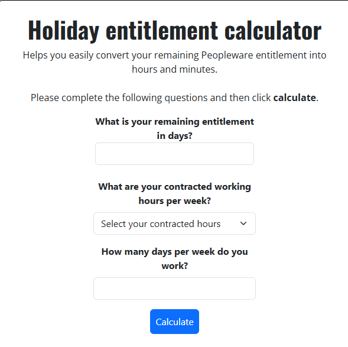

# Holiday Entitlement Calculator

A React application that calculates an employee's remaining holiday entitlement based on their contracted hours and working pattern.

## Live Site

[View the live application](https://entitlement-calculator.vercel.app/)

## Preview

## About

This project was built to solve a real problem by calculating employees' remaining holiday entitlement. While building it, I improved my understanding of business logic by creating calculations that reflect different working patterns and contracted hours.

I also gained experience with form validation, state management and handling user input to make sure the calculations were accurate.

## Features

- Calculate remaining holiday entitlement
- Supports different contracted hours
- Supports different working patterns
- Form validation to prevent invalid input
- Responsive design

### Frameworks & Tools

- [React](https://react.dev/)
- [React-Bootstrap](https://react-bootstrap.netlify.app/)
- [Git](https://git-scm.com/)
- [Github](https://github.com/)

## Deployment

This application was created using GitPod and was then pushed to GitHub to the respository called [entitlement-calculator]((https://github.com/mattthughes/entitlement_calculator)

To make sure I was able to keep updated with the changes I used the following git commands:

git add- This command was used to add the changes to the staging area before changes are commited.

git commit -m "message"- This command was used to add the changes to the repository queue.

git push - This command pushes all the commited code in the repository queue to Github.

### Running Application Locally

Navigated to the GitHub Repository:

1. Click on the code drop down and click on HTTPS
2. Copy the Repository link to the clipboard
3. Open your IDE such as GitPod, CodeAnywhere or any of your choosing making sure git is also installed
4. Type git clone alongside the repository link you have just copied into the IDE terminal, the project will now be cloned for use.

### Fork Project

1. Log in or sign u to GitHub.
2. Go to the repository for this project [mattthughes/entitlement-calculator](https://github.com/mattthughes/entitlement_calculator)
3. Click the Fork button on the right corner to fork the project.

